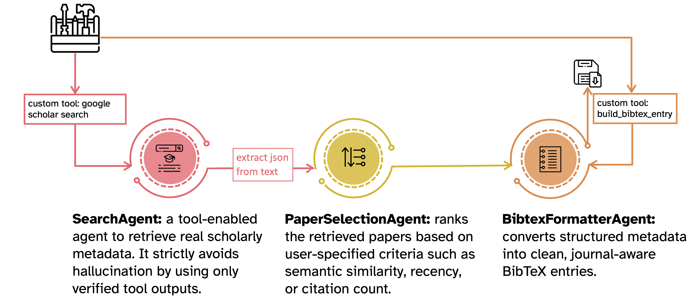

# CiteKnight
CiteKnight is a multi-agent system that transforms raw scholarly search results into structured, ranked, and publication-ready BibTeX files.



This is my final project for the Google 5-Day AI Agents Intensive course. 

Through specialized agents for Google Scholar search, metadata processing, relevance ranking, and citation formatting, CiteKnight ensures accurate, non-hallucinated, standards-compliant academic references for your LaTeX templates.

Built as a multi-agent system with clear separation of duties, CiteKnight orchestrates a complete research-automation pipeline from query to .bib file.

At its core, CiteKnight uses:
* SearchAgent: a tool-enabled agent that calls a custom google_scholar_search tool (powered by SerpAPI) to retrieve real scholarly metadata. It strictly avoids hallucination by using only verified tool outputs.
* PaperSelectionAgent: ranks the retrieved papers based on user-specified criteria such as semantic similarity, recency, or citation count. This agent applies structured JSON reasoning and produces deterministic, machine-readable relevance ordering.
* BibtexFormatterAgent: converts structured metadata into clean, journal-aware BibTeX entries using a custom build_bibtex_entry tool. 

This guarantees syntactic correctness, prevents invented fields (no fake DOIs), and enforces a harmonized citation style.

A full pipeline orchestrator integrates these agents sequentially to produce a polished .bib file saved locally for use in LaTeX projects. The system employs session-based state management, event-stream handling, and careful context engineering to maintain robustness across multi-step workflows.

CiteKnight fulfills many of the advanced agent-engineering criteria from the course, including:
* Multi-agent architecture with clear specialization and sequential orchestration
* LLM-powered agents (Gemini 2.5 Flash + Flash-Lite)
* Custom tool integration, including external APIs (SerpAPI) and custom Python tools for deterministic BibTeX generation
* Sessions & state management through InMemorySessionService and asynchronous streaming with run_async
* Context engineering to suppress hallucination, enforce schema adherence, and maintain structured outputs
* Observability through event-level tracing, debug streams, and tool-call monitoring
* Safe, structured outputs using typed dictionaries and JSON extraction

CiteKnight — your noble ally in academic quests.
Transforming your literature review into clean, organized citations.

### Citation

If you use this tool in your research, please cite the repository:

> Fatemeh Hadaeghi. CiteKnight: your noble ally in academic quests.. https://www.kaggle.com/competitions/agents-intensive-capstone-project/writeups/CiteKnight. 2025. Kaggle


### Example

```python

search_runner = InMemoryRunner(agent=search_agent)
selection_runner = InMemoryRunner(agent=paper_selection_agent)
bibtex_runner = InMemoryRunner(agent=bibtex_formatter_agent)

user_query = "no strong loop hypothesis in brain networks"


output_file = await run_full_pipeline(
    search_runner=search_runner,
    selection_runner=selection_runner,
    bibtex_runner=bibtex_runner,
    user_query=user_query,
    max_results=20,
    ranking_pref="similarity",   # or "recency", "citations"
    style="ieee, abbreviated journal names",
    output_path="no_strong_loop.bib",
)


# partial output here:
----------------------------------------
  1 | @article{NSL_Hadaeghi2025,
  2 |   title = {A computational perspective on the no-strong-loops principle in brain networks},
  3 |   author = {F Hadaeghi and K Fakhar and M Khajehnejad and CC Hilgetag},
  4 |   journal = {bioRxiv},
  5 |   year = {2025},
  6 |   url = {https://www.biorxiv.org/content/10.1101/2025.09.24.678310.abstract},
  7 | }
  8 | 
  9 | @article{NSL_Johnson2017,
 10 |   title = {Looplessness in networks is linked to trophic coherence},
 11 |   author = {S Johnson and NS Jones},
 12 |   journal = {Proc. Natl. Acad. Sci.},
 13 |   year = {2017},
 14 |   url = {https://www.pnas.org/doi/abs/10.1073/pnas.1613786114},
 15 | }
 16 | 
 17 | @article{NSL_Suzuki2023,
 18 |   title = {How deep is the brain? The shallow brain hypothesis},
 19 |   author = {M Suzuki and CMA Pennartz and J Aru},
 20 |   journal = {Nat. Rev. Neurosci.},
 21 |   year = {2023},
 22 |   url = {https://www.nature.com/articles/s41583-023-00756-z},
 23 | }
 24 | 
 25 | @article{NSL_Garrido2007,
 26 |   title = {Evoked brain responses are generated by feedback loops},
 27 |   author = {MI Garrido and JM Kilner and SJ Kiebel and KJ Friston},
 28 |   journal = {Proc. Natl. Acad. Sci.},
 29 |   year = {2007},
 30 |   url = {https://www.pnas.org/doi/abs/10.1073/pnas.0706274105},
 31 | }
 32 | 
 33 | @article{NSL_Papo22014,
 34 |   title = {Functional brain networks: great expectations, hard times and the big leap forward},
 35 |   author = {D Papo and M Zanin and JA Pineda-Pardo},
 36 |   journal = {Philos. Trans. R. Soc. B},
 37 |   year = {22014},
 38 |   url = {https://royalsocietypublishing.org/doi/abs/10.1098/rstb.2013.0525},
 39 | }
 40 | 
 41 | @article{NSL_Sporns2018,
 42 |   title = {Graph theory methods: applications in brain networks},
 43 |   author = {O Sporns},
 44 |   journal = {Dialogues Clin. Neurosci.},
 45 |   year = {2018},
 46 |   url = {https://www.tandfonline.com/doi/abs/10.31887/DCNS.2018.20.2/osporns},
 47 | }


