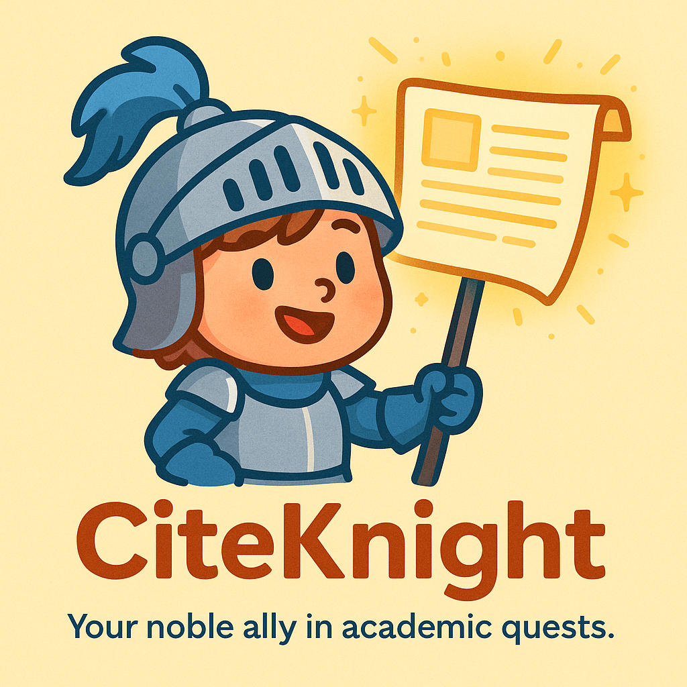

# CiteKnight
CiteKnight is a multi-agent system that transforms raw scholarly search results into structured, ranked, and publication-ready BibTeX files.

This is my final project for the Google 5-Day AI Agents Intensive course. 

Through specialized agents for Google Scholar search, metadata processing, relevance ranking, and citation formatting, CiteKnight ensures accurate, non-hallucinated, standards-compliant academic references for your LaTeX templates.

Built as a multi-agent system with clear separation of duties, CiteKnight orchestrates a complete research-automation pipeline from query to .bib file.

At its core, CiteKnight uses:
* SearchAgent: a tool-enabled agent that calls a custom google_scholar_search tool (powered by SerpAPI) to retrieve real scholarly metadata. It strictly avoids hallucination by using only verified tool outputs.
* PaperSelectionAgent: ranks the retrieved papers based on user-specified criteria such as semantic similarity, recency, or citation count. This agent applies structured JSON reasoning and produces deterministic, machine-readable relevance ordering.
* BibtexFormatterAgent: converts structured metadata into clean, journal-aware BibTeX entries using a custom build_bibtex_entry tool. 

This guarantees syntactic correctness, prevents invented fields (no fake DOIs), and enforces a harmonized citation style.

A full pipeline orchestrator integrates these agents sequentially to produce a polished .bib file saved locally for use in LaTeX projects. The system employs session-based state management, event-stream handling, and careful context engineering to maintain robustness across multi-step workflows.

CiteKnight fulfills many of the advanced agent-engineering criteria from the course, including:
* Multi-agent architecture with clear specialization and sequential orchestration
* LLM-powered agents (Gemini 2.5 Flash + Flash-Lite)
* Custom tool integration, including external APIs (SerpAPI) and custom Python tools for deterministic BibTeX generation
* Sessions & state management through InMemorySessionService and asynchronous streaming with run_async
* Context engineering to suppress hallucination, enforce schema adherence, and maintain structured outputs
* Observability through event-level tracing, debug streams, and tool-call monitoring
* Safe, structured outputs using typed dictionaries and JSON extraction

CiteKnight — your noble ally in academic quests.
Transforming your literature review into clean, organized citations.

